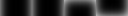

# World of Warcraft 1.12 Addon Tutorial (German)

> *Vorwort: Diese Tutorial hatte ich im Jahr 2015 für das Forum eines deutschen private servers geschrieben. Es war geplant eine Serie von Addon Tutorials zu schreiben, was Ich auf Grund mangelnder Nachfrage jedoch eingestellt hatte.*

Durch diese kleine Tutorial versuche ich kleine Addons anhand des Quelltextes zu erklären und jedermann die Welt von Lua und der WoW-API näher zu bringen.

In diesem ersten Guide geht es um **ShaguCombat**. Dies ist ein kleine Addon, dass den Infight Status anhand eines pulsierend rot leuchtenden Bildschirmrandes anzeigt.

Das Addon besitzt gerademal 50 Zeilen und eignet sich somit optimal für den Einstieg.

Behandelt werden folgende Themen:
1. TOC Dateien
2. Farbcodes
3. Frames
4. Backdrop Grafiken
5. Events
6. Timer & OnUpdate


## 1. TOC Dateien

Möchte man ein Addon schreiben, muss zunächst eine .toc Datei angelegt werden, welche den selben Dateinamen wie der Ordner besitzt. In meinem Fall: ShaguCombat

```toc
## Interface: 11200 
## Title: |cff33ffccShagu|cffffffffCombat
## Author: Shagu
## Notes: Notifies about your infight state via glowing screen edges
## Version: 0.1

ShaguCombat.lua
```

Die Interface Zeile, bezieht sich auf die Wow Version für welche wir das Addon schreiben. Für Vanilla Wow der Version 1.12 verwendet man: 11200.

Im Title steht, was der Wow Client bei der Addon Auswahl anzeigt. Für Farbcodes wird "|c" verwendet. (siehe: 2. Farbcodes)

Author und Version sollte selbsterklärend sein. "Notes" taucht in der Addon Auswahl als Beschreibung des Addons auf.

Nun muss noch die .lua Datei angegeben werden, welche das Spiel für das Addon laden soll. In diesem Beispiel ist es `ShaguCombat.lua`.


## 2. Farbcodes

Um inline-Farbcodes im Spiel zu setzen wird meist `|c` genutzt. Hierbei wird ein HEX Farbcode gewählt. die ersten beiden Hexadezimalstellen nach dem |c dienen der Transparenz, die nächsten stehen für Rot, dann Grün, dann Blau. `00` ist hierbei der niedrigste Wert, `FF` ist der höchste wert. Gezählt wird hierbei im Hexadezimal system von 0-9 dann von A-F (`0123456789ABCDEF`).

**|cFF**$\color{red}{\textsf{00}}\color{green}{\textsf{FF}}\color{blue}{\textsf{00}}$ wäre beispielsweise:
- Transparenz: 100% sichtbar (FF)
- Rot: 0% sichtbar (00)
- Grün: 100% sichtbar (FF)
- Blau: 0% visible (00)

Um die Farbe später zurückzusetzen wird `|r` genutzt:

**|c**$\textsf{FF0000FF}\color{blue}{\textsf{Blauer Text}}$**|r**Normaler Text

## 3. Frames

Los geht's mit dem Lua code. Man fängt zunächst an ein Frame zu erstellen:

```lua
-- build the frame
local ShaguCombat = CreateFrame("Frame")

ShaguCombat:SetFrameStrata("BACKGROUND")
ShaguCombat:SetWidth(GetScreenWidth() * UIParent:GetEffectiveScale())
ShaguCombat:SetHeight(GetScreenHeight() * UIParent:GetEffectiveScale())

ShaguCombat:SetPoint("CENTER",0,0)
ShaguCombat:Hide()
```

In der ersten Zeile wird hier ein Frame mit dem Namen "ShaguCombat" erstellt. Mittels "SetFrameStrata" kann eingestellt werden auf welcher Ebene es gezeichnet werden soll.

Hier gibt es folgende Möglichkeiten:
- "PARENT"
- "BACKGROUND"
- "LOW"
- "MEDIUM"
- "HIGH"
- "DIALOG"
- "FULLSCREEN"
- "FULLSCREEN_DIALOG"
- "TOOLTIP"

Zum Verständnis der Reihenfolge: `"BACKGROUND"` wird von `"LOW"` verdeckt, `"LOW"` wird von `"MEDIUM"` verdeckt, `"MEDIUM"` wird von `"HIGH"` verdeckt usw...
Ausnahme hier ist `"PARENT"`, denn dort handelt es sich nicht um die niedrigste Ebene, sondern es wird die gleiche STRATA verwendet, wie für das Frame aus welchem es hervorging.

In den folgenden Zeilen setzen wir die Breite und die Höhe (`SetWidth()` & `SetHeight()`) auf die Bildschirmgröße (`GetScreenWidth()` & `GetScreenHeight()`). 
Zusätzlich wird das UIScale berücksichtigt mittels: `UIParent:GetEffectiveScale()`

Nun richten wir das Frame In der Bildschirmmitte aus in dem wir `SetPoint()` auf `"CENTER"` setzen mit einem x-offset von 0 und einem y-offset von 0.
Zu guter Letzt wird nun das Frame durch `Hide()` verborgen.


## 4. Backdrop Grafiken

Da wir nun ein unsichtbares Frame haben, dass auch bei Sichtbarkeit keine Grafik hat, müssen wir ihm eine Textur unterschieben. Dies geht sehr einfach mittels eines Backdrops.
Ein Backdrop ist normalerweise ein Hintergrundbild + Grafiken für die Ränder. Im Lua code fügen wir nun folgendes hinzu:

```diff
+ -- define the border as "backdrop"
+ local backdrop = {
+   edgeFile = "Interface\\AddOns\\ShaguCombat\\border", edgeSize = 16,
+   insets = {left = 16, right = 16, top = 16, bottom = 16},
+ }

 -- build the frame
 local ShaguCombat = CreateFrame("Frame")

 ShaguCombat:SetFrameStrata("BACKGROUND")
 ShaguCombat:SetWidth(GetScreenWidth() * UIParent:GetEffectiveScale())
 ShaguCombat:SetHeight(GetScreenHeight() * UIParent:GetEffectiveScale())

+ ShaguCombat:SetBackdrop(backdrop)

 ShaguCombat:SetPoint("CENTER",0,0)
 ShaguCombat:Hide()
```

Wir definieren die Variable (bzw. die Tabelle) namens "backdrop". Hierbei wäre es möglich auch "bg" für ein Hintergrund zu setzen, jedoch wollen wir nicht, dass der komplette Bildschirm übermalt wird, sobald wir Aggro haben. Daher verwenden wir nur "edgeFile" welches sich um den Rahmen des Frames kümmert.

Ein Rahmen besteht aus 8 Bilder nebeneinander. Wie groß die Bilder sind, wird durch "edgeSize" definiert. In diesem Fall ist jede Rahmen Grafik 16x16 Pixel. Durch "insets" wird beschrieben, welchen Abstand der Rahmen vom Frame haben soll.

Man hat also ein Bild mit den Abmessungen: 8*16 auf 16 => 128x16 Pixel. Die Erste Grafik (von Links) ist der linke Rand, gefolgt von dem rechten Rand. Dann Oben, Unten, Links oben (Ecke), Rechts Oben (Ecke), Links unten (Ecke) und zu guter Letzt Rechts unten (Ecke). Wichtig hierbei ist zu wissen, dass der obere und untere Rahmen um 90° rotiert sind.

Eine Grafik in Wow muss immer ein vielfaches von 8 Pixeln sein. sprich:
128x16 = Durch 8 teilbar -> Passt.
129x17 = Nicht durch 8 teilbar -> Wird nicht geladen.

Meist wird hierfür eine .tga Grafik genutzt. Wird diese mit [GIMP](https://www.gimp.org/) erstellt, sollte man darauf achten die RLE Kompression abzuschalten.

Hier ein Beispiel wie das Backdrop Image am Schluss aussehen kann:

[[TGA]](border.tga)

Ingame testen könnte man nun wie folgt:
```
/script ShaguCombat:Show()
```

um das Frame sichtbar zu machen.
```
/script ShaguCombat:Hide()
```
um das Frame wieder zu verstecken.


## 5. Events

Da es nun relativ langweilig ist, ein Frame von Hand ein- und auszubleden, wollen wir das nun durch EVENTS erledigen. Grob gesagt finden im Spiel für diverse Dinge EVENTS statt, auf diese wir uns setzen und Aktionen durchführen können. Für dieses Addon nutzen wir `"PLAYER_REGEN_ENABLED"` und `"PLAYER_REGEN_DISABLED"`. Das erste wird ausgelöst, sobald die Mana und HP Regeneration einsetzt (outfight) und das zweite wird ausgelöst, sobald die Regenartion aussetzt (infight).

```diff
 -- define the border as "backdrop"
 local backdrop = {
   edgeFile = "Interface\\AddOns\\ShaguCombat\\border", edgeSize = 16,
   insets = {left = 16, right = 16, top = 16, bottom = 16},
 }
 
 -- build the frame
 local ShaguCombat = CreateFrame("Frame")
 
 ShaguCombat:SetFrameStrata("BACKGROUND")
 ShaguCombat:SetWidth(GetScreenWidth() * UIParent:GetEffectiveScale())
 ShaguCombat:SetHeight(GetScreenHeight() * UIParent:GetEffectiveScale())
 
 ShaguCombat:SetBackdrop(backdrop)
 ShaguCombat:SetPoint("CENTER",0,0)
 ShaguCombat:Hide()
 
+-- register for events
+ShaguCombat:RegisterEvent("PLAYER_REGEN_ENABLED")
+ShaguCombat:RegisterEvent("PLAYER_REGEN_DISABLED")
+
+-- show/hide on combat
+ShaguCombat:SetScript("OnEvent", function() 
+    if event == "PLAYER_REGEN_DISABLED" then
+        ShaguCombat:Show()
+        -- UIErrorsFrame:AddMessage("ShaguCombat |cffffffaa INFIGHT")
+    end
+    if event == "PLAYER_REGEN_ENABLED" then
+        ShaguCombat:Hide()
+        -- UIErrorsFrame:AddMessage("ShaguCombat |cffffffaa OUTFIGHT")
+    end
+end)
```

Wir setzen nun unser Frame auf die beiden Events durch "RegisterEvent()". Nun wird in unserem Frame bei jedem Auftreten eines der beiden Events die "OnEvent" Funktion aufgerufen. Der Inhalt dieser Funktion, kann nun mittels `SetScript("OnEvent", function() ... end)` befüllt werden.

Wir prüfen zunächst, welches der beiden Events erfolgt ist. Das derzeitige Event steht in der Variable "event".

Die auskommentierten Zeilen (Zeilen die mit `--` beginnen) zeigen, sofern man sie nutzen möchte auf der Bildschirmmitte "ShaguCombat INFIGHT" bzw. "ShaguCombat OUTFIGHT". Das kann zum Debuggen nützlich sein.

## 6. Timer & OnUpdate

Nun zeigt das Addon mit einem weißen Rahmen um den Bildschirm an, ob man sich Infight oder Outfight befindet. Das wirkt natürlich nicht sehr hübsch, daher werden wir nun den "glow"-Effekt hinzufügen.

```diff
 -- define the border as "backdrop"
 local backdrop = {
   edgeFile = "Interface\\AddOns\\ShaguCombat\\border", edgeSize = 16,
   insets = {left = 16, right = 16, top = 16, bottom = 16},
 }
 
 -- build the frame
 local ShaguCombat = CreateFrame("Frame")
 
 ShaguCombat:SetFrameStrata("BACKGROUND")
 ShaguCombat:SetWidth(GetScreenWidth() * UIParent:GetEffectiveScale())
 ShaguCombat:SetHeight(GetScreenHeight() * UIParent:GetEffectiveScale())
 
 ShaguCombat:SetBackdrop(backdrop)
 ShaguCombat:SetPoint("CENTER",0,0)
 ShaguCombat:Hide()
 
 -- register for events
 ShaguCombat:RegisterEvent("PLAYER_REGEN_ENABLED")
 ShaguCombat:RegisterEvent("PLAYER_REGEN_DISABLED")
 
+-- let it fade..
+ShaguCombat:SetScript("OnUpdate",function(s,e)
+    if not ShaguCombat.clock then    ShaguCombat.clock = GetTime() -0.1 end
+    if GetTime() >= ShaguCombat.clock + 0.1 then
+        ShaguCombat.clock = GetTime()
+
+        if not ShaguCombat.fadeValue then    ShaguCombat.fadeValue = 1 end
+        if ShaguCombat.fadeValue >= 0.3 then
+            ShaguCombat.fadeModifier = -0.1
+        end
+        if ShaguCombat.fadeValue <= 0 then
+            ShaguCombat.fadeModifier = 0.1
+        end
+        ShaguCombat.fadeValue = ShaguCombat.fadeValue + ShaguCombat.fadeModifier
+        ShaguCombat:SetBackdropBorderColor(1,0.2+ShaguCombat.fadeValue, ShaguCombat.fadeValue, 1-ShaguCombat.fadeValue);
+    end
+end)
 
 -- show/hide on combat
 ShaguCombat:SetScript("OnEvent", function() 
     if event == "PLAYER_REGEN_DISABLED" then
         ShaguCombat:Show()
         -- UIErrorsFrame:AddMessage("ShaguCombat |cffffffaa INFIGHT")
     end
     if event == "PLAYER_REGEN_ENABLED" then
         ShaguCombat:Hide()
         -- UIErrorsFrame:AddMessage("ShaguCombat |cffffffaa OUTFIGHT")
     end
 end)
```

Hierfür nutzen wir die `OnUpdate` Funktion unseres Frames. Diese wird bei jeder Zeichnung, aufgerufen. D.h. bei 30 FPS wird sie 30x pro Sekunde aufgerufen.
Direkt hier den "Glow" Effekt einzubringen, würde bedeuten, dass es bei 8 FPS langsamer blinkt als bei 116 FPS. Um das zu verhindern nutzen wir die System Zeit.

Sollte die Variable ShaguCombat.clock nicht gesetzt sein, füllen wir sie mit dem Inhalt der derzeitigen Uhrzeit - 0.1 Sekunden.
(`if not ShaguCombat.clock then ShaguCombat.clock = GetTime() - 0.1 end`)

Nun wird bei jedem Frame geprüft, ob die momentane Uhrzeit bereits der Variablen Inhalt + 0.1 Sekunde ist. Ist dies der Fall, wird unsere "clock" Variable auf die momentane Zeit gesetzt und der Inhalt unseres "Timer"-Blocks ausgeführt. (`if GetTime() >= ShaguCombat.clock + 0.1 then [...]`) Fertig ist der 0.1 Sekunden-Timer.

Ich werde hier jetzt nicht genau auf den Inhalt eingehen, da dass setzen von Variablen, Rechnen mit Variablen usw. auch für jemanden der nicht programmiert nachvollziebar sein sollte, wenn er sich ein wenig anstrengt.

Was nun geschieht ist, dass temporäre Fade-Variablen gesetzt werden, welche auf- bzw herabgezählt werden. Und durch "SetBackdropBorderColor()" bekommt unser Rahmen alle 0.1 Sekunden die entsprechende Färbung. Diese Funktion benötigt folgende Parameter: SetBackdropBorderColor(<span style="color:#f00">rot</span>, <span style="color:#0f0">grün</span>, <span style="color:#00f">blau</span>, transparenz)


## 7. Ende

Der komplette Code sollte nun wie folgt aussehen:
```lua
-- define the border as "backdrop"
local backdrop = {
  edgeFile = "Interface\\AddOns\\ShaguCombat\\border", edgeSize = 16,
  insets = {left = 16, right = 16, top = 16, bottom = 16},
}

-- build the frame
local ShaguCombat = CreateFrame("Frame")

ShaguCombat:SetFrameStrata("BACKGROUND")
ShaguCombat:SetWidth(GetScreenWidth() * UIParent:GetEffectiveScale())
ShaguCombat:SetHeight(GetScreenHeight() * UIParent:GetEffectiveScale())

ShaguCombat:SetBackdrop(backdrop)
ShaguCombat:SetPoint("CENTER",0,0)
ShaguCombat:Hide()

-- register for events
ShaguCombat:RegisterEvent("PLAYER_ENTERING_WORLD")
ShaguCombat:RegisterEvent("PLAYER_REGEN_ENABLED")
ShaguCombat:RegisterEvent("PLAYER_REGEN_DISABLED")

-- let it fade..
ShaguCombat:SetScript("OnUpdate",function(s,e)
  if not ShaguCombat.clock then  ShaguCombat.clock = GetTime() -0.1 end
  if GetTime() >= ShaguCombat.clock + 0.1 then
    ShaguCombat.clock = GetTime()

    if not ShaguCombat.fadeValue then  ShaguCombat.fadeValue = 1 end
    if ShaguCombat.fadeValue >= 0.3 then
      ShaguCombat.fadeModifier = -0.1
    end
    if ShaguCombat.fadeValue <= 0 then
      ShaguCombat.fadeModifier = 0.1
    end
    ShaguCombat.fadeValue = ShaguCombat.fadeValue + ShaguCombat.fadeModifier
    ShaguCombat:SetBackdropBorderColor(1,0.2+ShaguCombat.fadeValue, ShaguCombat.fadeValue, 1-ShaguCombat.fadeValue);
  end
end);

-- show/hide on combat
ShaguCombat:SetScript("OnEvent", function() 
  if event == "PLAYER_REGEN_DISABLED" then
    ShaguCombat:Show()
    -- UIErrorsFrame:AddMessage("ShaguCombat |cffffffaa INFIGHT")
  end
  if event == "PLAYER_REGEN_ENABLED" or event == "PLAYER_ENTERING_WORLD" then
    ShaguCombat:Hide()
    -- UIErrorsFrame:AddMessage("ShaguCombat |cffffffaa OUTFIGHT")
  end
end)
```

Das wars auch schon. Hier das komplette Addon zum Download: 
[Download: ShaguCombat](https://github.com/shagu/ShaguCombat/archive/master.zip)

Viel Spaß im Code und vergesst nicht einen ⭐ dazulassen.